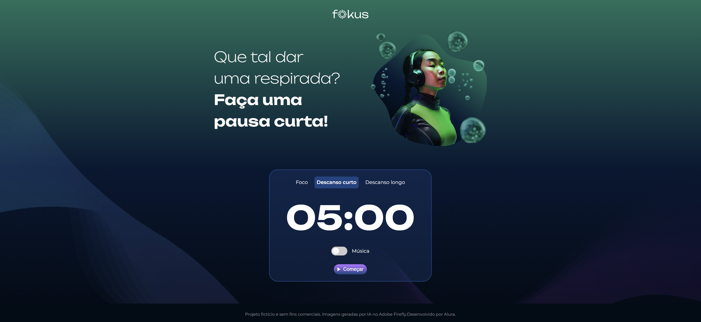

# Fokus Timer

Fokus Timer é um aplicativo de temporizador que ajuda a otimizar a produtividade, alternando entre períodos de foco e descanso.

## Estrutura do Projeto

## Arquivos

- **index.html**: Contém a estrutura HTML do aplicativo.
- **script.js**: Contém a lógica JavaScript para o funcionamento do temporizador.
- **styles.css**: Contém os estilos CSS para a aparência do aplicativo.
- **imagens/**: Contém as imagens utilizadas no aplicativo.
- **sons/**: Contém os arquivos de áudio utilizados no aplicativo.

## Funcionalidades

- Temporizador para períodos de foco, descanso curto e descanso longo.
- Alternância entre diferentes contextos (foco, descanso curto, descanso longo).
- Reprodução de música de fundo durante o período de foco.
- Sons de alerta para início e pausa do temporizador.

## Como Usar

1. Abra o arquivo `index.html` em um navegador web.
2. Clique nos botões "Foco", "Descanso curto" ou "Descanso longo" para selecionar o período desejado.
3. Clique no botão "Começar" para iniciar o temporizador.
4. Use o botão de alternância para ativar ou desativar a música de fundo.
5. O temporizador exibirá o tempo restante e tocará um som quando o tempo acabar.

## Tecnologias Utilizadas

- HTML
- CSS
- JavaScript

## Prints do Aplicativo

## Créditos

Projeto fictício e sem fins comerciais. Imagens geradas por IA no Adobe Firefly. Desenvolvido por Alura.

